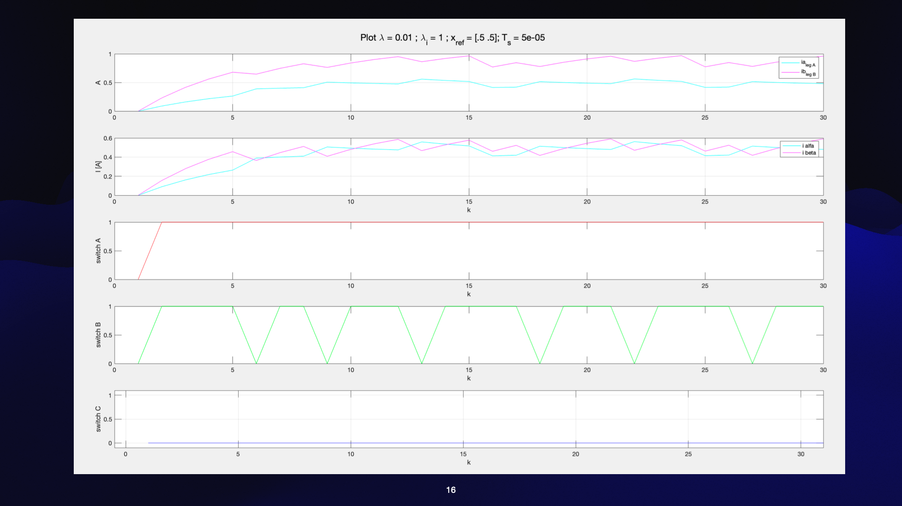
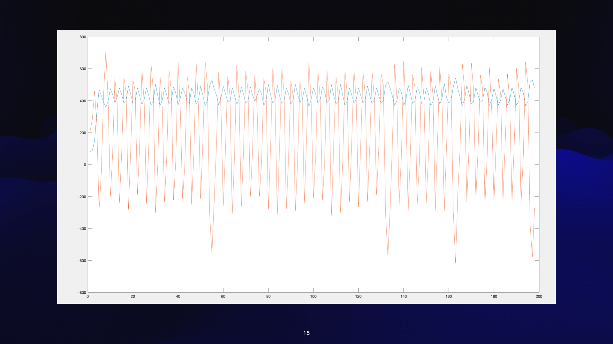

## Core

Folder contains C code programs.

## Documentation

Folder contains schematics.

## Matlab

Folder contains matlab code.

## Experiments

Folder contain C++ code. The flashing debugging code in c++ is too big. It uses eigen library.

## procedures

Sensor current calibration.
Double check parameters.
Clock configuration based on STM32.

## V1 13-06-24

Floating point STM32. Main branch.

### flash building size

arm-none-eabi-objdump -h -S MPCv1.elf  > "MPCv1.list"
text	   data	    bss	    dec	    hex	filename
45120	    608	   8368	  54096	   d350	MPCv1.elf
Finished building: default.size.stdout
 

### outcomes

#### matlab simulation

#### setup output

## V2

Fixed point. Different branch.